# edatoolkit 

[](https://www.python.org/)
[](LICENSE)
[]()
[]()

A robust, **Object-Oriented (OOP)** Python package for automated **Exploratory Data Analysis (EDA)**.

The toolkit has been refactored into a **fully modular architecture**: each analytical concern now lives in its own dedicated class inside a proper Python package. The unified `EDA` facade wires everything together, so your existing code continues to work unchanged while the internals are clean, testable, and extensible.

---

## Architecture



---

## Package Structure

```
edatoolkit/
├── edatoolkit/
│   ├── __init__.py           ← exports all public classes
│   ├── eda.py                ← EDA facade (orchestrator)
│   ├── inspector.py          ← Inspector class
│   ├── normality.py          ← NormalityAnalyzer class
│   ├── outliers.py           ← OutlierAnalyzer class
│   ├── categorical.py        ← CategoricalAnalyzer class
│   ├── target.py             ← TargetAnalyzer class
│   ├── correlation.py        ← Correlation class
│   ├── helpers.py            ← shared statistical helpers
│   └── assets/
│       └── skeleton.gif
├── Examples/
│   ├── example1.ipynb
│   └──  example2.ipynb
├── setup.py
├── requirements.txt
├── README.md
└── LICENSE
```

---

## Module Overview

| Module | Class | Responsibility |
|---|---|---|
| `inspector.py` | `Inspector` | Column type classification, dataframe overview |
| `normality.py` | `NormalityAnalyzer` | Descriptive stats, normality tests, distribution plots |
| `outliers.py` | `OutlierAnalyzer` | Outlier detection, removal, and capping |
| `categorical.py` | `CategoricalAnalyzer` | Value counts, ratios, bar charts |
| `target.py` | `TargetAnalyzer` | Target vs categorical / numerical statistical analysis |
| `correlation.py` | `Correlation` | Correlation heatmaps (Pearson / Spearman / Kendall) |
| `helpers.py` | *(functions)* | `get_groups`, `select_group_test`, `calculate_advanced_effect_size` — shared test logic |
| `eda.py` | `EDA` | Facade that orchestrates all modules above |

---

## Key Features

### Automated Column Classification

Columns are automatically categorized on initialization:

| Bucket | Description | Controlled by |
|---|---|---|
| `cat_cols` | Categorical variables (object, bool, category) | — |
| `num_cols` | Continuous numerical variables | — |
| `num_but_cat` | Numeric columns with low cardinality (treated as categorical) | `cat_th` |
| `cat_but_car` | High-cardinality categoricals (excluded from cat analysis) | `car_th` |

> `num_but_cat` columns are merged into `cat_cols`. `cat_but_car` is excluded from both. Inspect them via `eda.cat_but_car`.

### Numerical Analysis

Extended descriptive statistics: percentiles (1%→99%), mean, median, std, **CV%**, skewness, kurtosis.

### Normality Diagnostics

Per-column Q-Q plot, histogram, and box plot — plus automatic test selection:

- **Shapiro-Wilk** for `n ≤ 2500`
- **D'Agostino K²** for `n > 2500`

> Always validate visually before finalizing normality decisions.

### Smart Outlier Detection

Distribution-aware method selection per column:

- **Normal** → Z-score (default: ±3σ)
- **Non-normal** → IQR (default: 1.5×)

Options: detect only · remove rows · cap (winsorize).

### Target-Based Statistical Analysis

**Target(categorical) vs Categorical:**
- Chi-Square test + Cramér's V effect size
- Crosstab heatmaps with percentage normalization

**Target(categorical) vs Numerical — test selected automatically:**

| Condition | Test |
|---|---|
| 2 groups, normal, n > 30 | Welch's t-test |
| 2 groups, otherwise | Mann-Whitney U |
| 3+ groups, normal, equal variance | One-Way ANOVA |
| 3+ groups, otherwise | Kruskal-Wallis |
> When H₀ is rejected, effect size is computed automatically (r, η², or ε²)
> with a plain-English interpretation of its practical significance.

**Target(numerical) vs Numerical:**
- Pearson (both columns normal) or Spearman (otherwise)
- Scatter plot with regression line + strength label

**Target(numerical) vs Categorical:**

| Condition | Test |
|---|---|
| 2 groups, normal, n > 30 | Welch's t-test |
| 2 groups, otherwise | Mann-Whitney U |
| 3+ groups, normal, equal variance | One-Way ANOVA |
| 3+ groups, otherwise | Kruskal-Wallis |
> When H₀ is rejected, effect size is computed automatically (r, η², or ε²)
> with a plain-English interpretation of its practical significance.


### Correlation Heatmap

Annotated heatmaps using Pearson, Spearman, or Kendall.

---

## Recommended Workflow

>  Some methods depend on earlier steps. Follow this order:

```
1.  EDA(df, target_col)              # Initialize — column types auto-classified
2.  check_dataframe()                # Overview: head, shape, NA, duplicates
3.  descriptive_analysis()           # Extended descriptive stats
4.  check_num()                      # Visualize + test normality
5.  num_summary({...})               # ← REQUIRED before steps 6–9
6.  check_outlier(...)               # Outlier detection / removal / capping
7.  cat_summary()                    # Categorical value counts + charts
8.  target_summary_with_cat()        # Target vs categorical analysis
9.  target_summary_with_num()        # Target vs numerical analysis
10. correlation_heatmap()            # Correlation matrix
```

---

## Installation

```bash
git clone https://github.com/elvinaliyev2006/edatoolkit.git
cd edatoolkit
pip install -e .
```

---

## Dependencies

| Package | Purpose |
|---|---|
| `pandas` | DataFrame operations |
| `numpy` | Numerical computations |
| `matplotlib` | Static visualizations |
| `seaborn` | Statistical plot styling |
| `scipy` | Statistical tests |

```bash
pip install -r requirements.txt
```

---

## Quick Start

```python
from edatoolkit import EDA
import pandas as pd

df = pd.read_csv("data.csv")
eda = EDA(dataframe=df, target_col="target")

# 1. General overview
eda.check_dataframe()

# 2. Descriptive statistics
eda.descriptive_analysis()

# 3. Normality diagnostics
non_normal_cols = eda.check_num(plot=True)

# 4. Record normality decisions (REQUIRED)
eda.num_summary({
    "age":    "Normal",
    "income": "Non-normal"
})

# 5. Handle outliers
eda.check_outlier(cap=True)

# 6. Categorical analysis
eda.cat_summary(plot=True)

# 7. Target-based analysis
eda.target_summary_with_cat(plot=True)
eda.target_summary_with_num(plot=True)

# 8. Correlation
eda.correlation_heatmap(method="spearman")
```

### Use individual modules directly

```python
from edatoolkit import Inspector, NormalityAnalyzer, OutlierAnalyzer

inspector = Inspector()
cat_cols, num_cols, num_but_cat, cat_but_car = inspector.get_columns_types(df)
inspector.check_dataframe(df)

normality = NormalityAnalyzer()
normality.descriptive_analysis(df, num_cols)
normality.check_num(df, num_cols, plot=True)
```

---

## Parameters

### `EDA` constructor

| Parameter | Type | Description | Default |
|---|---|---|---|
| `dataframe` | `pd.DataFrame` | Input dataset | Required |
| `target_col` | `str` | Target column name | Required |
| `cat_th` | `int` | Numeric → categorical threshold (unique count) | `10` |
| `car_th` | `int` | High-cardinality threshold for categoricals | `20` |
| `alpha` | `float` | Significance level for all hypothesis tests | `0.05` |

### `check_outlier()`

| Parameter | Type | Description | Default |
|---|---|---|---|
| `iqr_th` | `float` | IQR multiplier | `1.5` |
| `z_score_th` | `int` | Z-score threshold | `3` |
| `q1_th` | `float` | Lower percentile used for IQR calculation | `0.25` |
| `q3_th` | `float` | Upper percentile used for IQR calculation | `0.75` |
| `remove` | `bool` | Drop outlier rows | `False` |
| `cap` | `bool` | Winsorize outliers | `False` |

> `remove` and `cap` cannot both be `True`.
> `q1_th` must be less than `q3_th`, and both must be between `0` and `1`.

> `remove` and `cap` cannot both be `True`.

### `num_summary()`

| Parameter | Type | Description |
|---|---|---|
| `result_dict` | `dict` | `{"col": "Normal" \| "Non-normal"}`. Unlisted columns default to `"Normal"`. |

### `correlation_heatmap()`

| Parameter | Type | Options | Default |
|---|---|---|---|
| `method` | `str` | `"pearson"`, `"spearman"`, `"kendall"` | `"spearman"` |

---

## Common Errors

| Error | Cause | Fix |
|---|---|---|
| `RuntimeError: Run num_summary() first.` | Called `check_outlier()` or `target_summary_with_num()` before `num_summary()` | Run `check_num()` then `num_summary({...})` |
| `ValueError: ! num_cols is empty` | No numerical columns detected | Check `cat_th` — it may be treating all numerics as categorical |
| `ValueError: ! cat_cols is empty` | No categorical columns detected | Verify dtypes or lower `cat_th` |
| `ValueError: remove and cap cannot both be True` | Both flags set simultaneously | Use only one of `remove=True` or `cap=True` |

---

## Design Philosophy

-  **Modularity** — each analytical concern isolated in its own class; import only what you need
-  **Statistical correctness** — automatic test selection with appropriate fallbacks
-  **Automation + flexibility** — semi-automated with full manual override support
-  **Visual + analytical validation** — never trust a test without inspecting the plot
-  **Stateful** — normality decisions and reports persist across method calls for ML pipeline integration

---


## License

Licensed under the **MIT License**. See [LICENSE](LICENSE) for details.

---

## Contributing

Contributions are welcome! Fork the repository and submit a pull request. For major changes, open an issue first to discuss your proposal.

---

## Support

If you find this project useful, consider giving it a **star  on GitHub** — it really helps!
